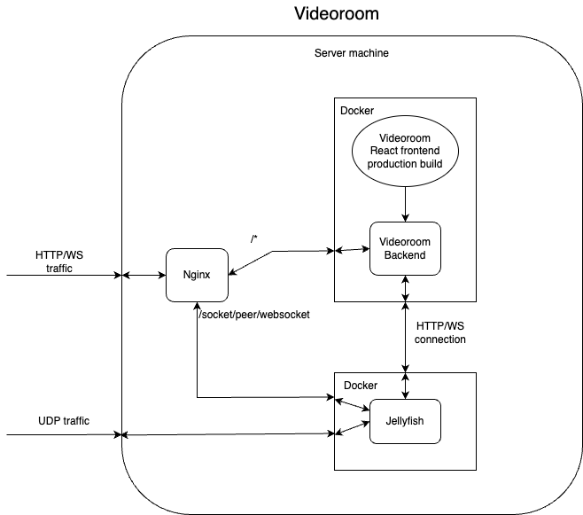

# Videoroom deployment architecture

This document describes proposed Videoroom deployment architecture after migration to Jellyfish.

## New architecture

As before, the server machine will listen on ports:

- 80/TCP, 443/TCP for HTTP and WebSocket traffic,
- e.g. 50000-59999/UDP range for media traffic (or some other specified range).

Jellyfish will be directly responsible for managing UDP traffic, listening on public interfaces on the specified ports.

When it comes to the HTTP and WebSocket traffic, Nginx is responsible for TLS and will be used as a reverse proxy, listening for the HTTP/WS traffic on public interfaces and forward the traffic to:

- Jellyfish, for `/socket/peer/websocket` in order to make it possible to establish direct signalling connection between peers and Jellyfish,
- Videoroom Backend, for /* in order to be able to make API requests and serve the pre-build frontend.

That means the Jellyfish and Videoroom Backend will only need to listen for HTTP/WebSocket traffic on loopback interfaces, not accessible from outside of the server machine. The Videoroom backend will also need to open WebSocket connection to Jellyfish to receive notifications, and make API requests.

## Example

Let’s assume that Videoroom server machine is available under domain `videoroom.com`. Videoroom Backend is running on `localhost:4000` and Jellyfish is running on `localhost:3000`. This scenario describes a peer trying to join already existing meeting/room:

1. Peer makes `https://videoroom.com` `GET` request to access Videoroom frontend (served via Backend).
2. After fetching the frontend, they want to join the room with room_id, making a request like `https://videoroom.com/api/room/<room_id>` `POST` request, which means “I want to join the meeting with room_id“.
3. Nginx receives the request and forwards it to Videoroom Backend (`http://localhost:4000/api/room/room_id` POST), which makes a request to Jellyfish (`http://localhost:3000/room/<room_id>/peer POST`). Jellyfish creates the peer and returns information about them and their `peer_token`. Videoroom Backend returns the token (and possibly some other information) to Nginx, which returns it to the caller.
4. The caller opens signalling connection to `wss://videoroom.com/socket/peer/websocket` which is forwarded by Nginx to `ws://localhost:3000/socket/peer/websocket` and authenticates itself using received `peer_token`.
5. Now the peer can establish WebRTC connection and send/receive media via the exposed UDP ports (e.g. `videoroom.com:50000-59999/UDP`)

## Development

For convenience, in development React App and its development server will be used instead of Phoenix build system, but Phoenix will be responsible for serving the frontend (pre-build with React Tools) in deployment.

To avoid issues with CORS in development, one can proxy requests to the Backend via the server proxy options, as described here: [Vite](https://vitejs.dev/config/server-options.html#server-proxy)
