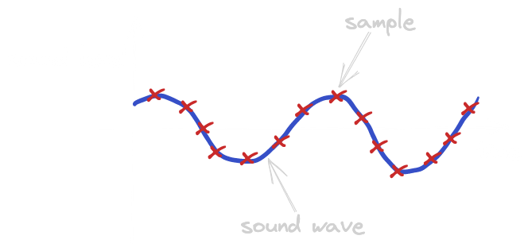

# Media Intro

This contains list of things that we consider worth learning at the begging of your multimedia journey.
The most important topics are briefly described.

## Glossary

- codecs
- formats
- containers
- muxing/demuxing

## Raw media

### Raw audio representation

Audio is broadcasted in the air, or other environments, as a soundwave. Its amplitude determines the sound level, while frequency corresponds to the pitch. To capture a sound, the microphone periodically measures the sound level - each measurement we call a `sample`. Having a sequence of samples, we can reconstruct the shape of the sound wave.



To have the sound wave reconstructed properly, we need to have enough frequent measurements. That frequency is referred to as a `sample rate` and has to be at least twice as big as the audio (sound wave) frequency, as we need to account for both the peaks and the troughs in the wave. 8 kHz rate (8000 samples per second) is usually used to register human speech (for example in GSM), 41 or 48 kHz - for standard quality audio, and 96 kHz - for high-quality audio.


As each sample represents the sound level, it is stored as a number. Depending on the needed audio quality, it can be an 8 to 32-bit integer. Sometimes, audio is stored in 32 or 64-bit floats, ranging from 0 to 1. That way we can achieve better accuracy for silent sounds, at the cost of loud ones. Samples can be stored as big or little-endian and signed or unsigned numbers. The `sample format` is often described with the use of the following syntax:

```
<s|u|f><8..64><le|be>
```

which expands to

```
<signed|unsigned|float><8..64 bit><little|big endian>`
```

For example, `s16le` would mean signed, 16-bit, little endian integer.

Both `sample rate` and `sample format` of audio can be changed, though that may involve `resampling` or `dithering`, respectively.

The audio stream can also have multiple channels - a phone call would usually have a single one, stereo recording will have two, while a surround sound may have five or more of them. Each channel means another, separate sound wave, so we need to store multiple sequences of samples. Samples of each channel may be stored either in `interleaved` or `planar` format. The interleaved format assumes storing corresponding samples from all channels together, for example

```
ABCDABCDABCDABCD...
```

while in planar format samples from each channel are stored in large chunks, possibly covering the entire stream:

```
AAAAAAAAAAA... BBBBBBBBBBBB... CCCCCCCCCCCC... DDDDDDDDDDDDDD...
```

To sum up, raw audio is stored as a sequence of samples and can have different

- sample rate
- sample format
- amount of channels

The method described above is called `Pulse Code Modulation (PCM)` and is the state-of-the-art way to store raw audio data.

### Raw video representation

Digital video is basically a sequence of digital photos displayed one by one. Each of these photos is called a `frame`, and the amount of photos per second is usually referred to as `frame rate` or `FPS` (frames per second). It's sometimes not an integer and expressed as a {numerator, denominator} tuple.

Each frame is represented by a bitmap and the color of each pixel is represented by a few numbers, according to the `color space`. The most frequently used color spaces are `RGB` and `YUV`. In RGB, colors are described with three numbers, reflecting the level of red, green and blue, respectively. In YUV, we have Y for luminance, while U and V represent chrominance. Like in the case of audio, these numbers can be stored using a different number of bytes (here called `color_depth`) and in interleaved (here often called `packed`) or planar format. For YUV, the packed format would look like YUVYUVYUVYUV..., while the planar would be YYYYY... UUUUU... VVVVV.... Both RGB and YUV have their `alpha` version - `RGBa` and `YUVa` - with additional alpha number representing transparency. They are mainly used in video editing/compositing, to express overlapping video layers.

## Codecs

Raw audio and (especially!) video streams may generate an enormous amount of data - Full HD RGB frame takes almost 6 Megabytes with 30 frames per second, it gives 180 Megabytes per second, so if we want to store it or send it over a network, we need to compress it.
The same goes for audio - we can save a lot of bandwidth by using compression.

### Video compression

The most basic way to reduce the number of bytes taken by video stream is to focus on every single frame - this approach is called `intra-frame compression`.
In essence, this is very similar to picture compression like JPEG and there's even a video codec called MJPEG which is simply a stream of JPEG encoded frames.
The first step is usually a very simple yet effective format conversion to one with `chroma subsampling` like the most popular YUV with 4:2:0 subsampling (called I420 in GStreamer and yuv420p in FFmpeg).
This format uses one byte for every pixel in the Y (luminance) plane, but each value in U (Cb, chrominance) and V (Cr, chrominance) planes represents 4 pixels (2 by 2 square).
As a result, conversion from RGB using 24 bits per pixel to YUV using 12 bits per pixel (on average) reduces image size by half. There are other patterns of subsampling like 4:2:2 in which chroma planes are sampled at half of the horizontal resolution (one value for 2 horizontal pixels)

```
Using smaller resolution for chroma planes goes in line with human eye construction - we have 2 types of photoreceptors - cones (pl. czopki) responsible for color vision and rods (pl. pręciki) sensitive to brightness. Rods are much more sensitive to light, which can be observed in low-light conditions - we can see shapes, but not colors which means there's not enough light for cones to function.
```

The next steps are usually taken (based on what JPEG does) are:

- splitting image into `macroblocks` (e.g. 8x8)
- applying transformation like DCT (Discrete cosine transformation) to each block - this step converts block into average block color/brightness and frequencies of changes - this step is lossless
- `quantization` - the values are rounded to integers and divided by appropriate factors - the used matrix of factors is the higher it is, the lower the quality. This step is lossy and can be used to control output image quality
- using some kind `entropy encoding` - the previous step usually result in many similar values or even 0s (more if a higher quantization factor is used), so this lossless step can also help

#### Intra-frame compression

- types of frames: I-frame/keyframe, P-frame, B-frame
- DTS & PTS
- h26x byte stream - NALUs, AUs, GOPs
- other examples of codecs - VPx, AV1
- simulcast, VP9 SVC

#### Audio codecs

- lossy coding techniques
- lossless coding techniques
- examples of codecs - AAC, OPUS, FLAC, MP3...

## Containers

- role of containers - multiplexing, timestamping
- examples of containers - MP4, WebM, MKV, MP3...

## Networking

- IP basics
    - IPv4, IPv6, ports, routing fundamentals
- TCP, UDP
    - overview and differences
    - consequences for media streaming
- NAT
    - what is it, what for etc.
    - types of NAT
    - bypassing NAT

## Streaming

- RTP
    - overview - RTP header, RTCP, SRTP
    - use cases
- MPEG-TS
    - overview
    - use cases
- HLS, DASH
    - overview - HTTP, playlists and chunks
    - use cases
- WebRTC
    - glossary
        - media track - by media track we mean single audio or video\
        - media stream - media stream consists of one or more media tracks. It's used for grouping tracks that are related e.g. audio track from user microphone and video track of user camera can be included in one media stream
    - overview
        - standard that enables P2P (peer to peer) multimedia connections in web browsers without using any plugins. It's widely used in videoconferencing systems. WebRTC is not a protocol, instead, it's often called 'protocol umbrella' i.e. it combines a lot of different internet protocols (ICE, DTLS, RTP, etc.).
    - underlying codecs and protocols - ICE, DTLS, SRTP, SDP, ...
        - ICE - Interactive Connectivity Establishment, a network protocol that enables connecting two peers that are both behind NATs. Under the hood, it uses STUN and TURN protocols.
        - DTLS - Datagram TLS, TLS but for UDP protocol. It provides so-called 'keying material' that is used to create keys for encrypting and decrypting packets carrying media data (RTP packets). Media packets are not encapsulated in DTLS. DTLS only provides cryptographic context. DTLS is also used by SCTP protocol which is described below.
        - SDP - Session Description Protocol - it's called a protocol but in fact, it could be considered more as a data format. It's used to described multimedia session parameters - how many tracks the user is willing to send and receive, which codecs are preferred, etc.
        - RTP - Real-time Transport Protocol - used for conveying media data, will be described above.
        - RTCP - Real-time Transport Control Protocol - control protocol for RTP, will also be described above.
        - SRTP - extension/profile for RTP protocol that defines the way RTP packets are encrypted and decrypted
        - SCTP - reliable protocol (unlike RTP) that is used for carrying non-media data (text messages, files, etc.). Its packets are encapsulated in DTLS (unlike RTP packets).
    - use cases
        - videoconferencing systems
        - P2P connections of hosts that are both behind NATs
        - Discord uses WebRTC under the hood
    - useful links:
        - [WebRTC API](https://developer.mozilla.org/en-US/docs/Web/API/WebRTC_API)
        - [WebRTC W3C Standard](https://www.w3.org/TR/webrtc/)
        - [WebRTC Examples in JS](https://webrtc.github.io/samples/)
        - [WebRTC Examples in JS src code](https://github.com/webrtc/samples/tree/gh-pages/src/content)
        - [WebRTC basics](https://web.dev/webrtc-basics/)
        - [WebRTC signaling](https://web.dev/webrtc-infrastructure/)
        - [WebRTC signaling and video calling](https://developer.mozilla.org/en-US/docs/Web/API/WebRTC_API/Signaling_and_video_calling)
        - [WebRTC tutorial](https://codelabs.developers.google.com/codelabs/webrtc-web/#0)
        - [webrtcHacks](https://webrtchacks.com/)

## FFmpeg basic commands

1. Generating sample audio and video
```
ffmpeg -f lavfi -i sine=f=1:b=440:r=41000:d=10 -filter_complex "[0][0]amerge=inputs=2" -f lavfi -i testsrc=s=1920x1080:r=30,format=yuv420p -shortest -f flv - | ffplay -i -
```

Explanation:
- `-f lavfi` - virtual input
- `-i sine=f=1:b=440:r=41000:d=10` - generates sound with constant frequency, options: frequency 1Hz (unhearable), beep frequency 440*f = 440Hz, sample rate 44100, duration 10 seconds
- `-filter_complex "[0][0]amerge=inputs=2"` - converts mono to stereo
- `-i testsrc=s=1920x1080:r=30,format=yuv420p` - test video 1920x1080, 30 fps, yuv420p
- `-shortest` - trims all the tracks (audio/video) so they have equal duration - the duration of the shortest one
- `-f flv - | ffplay -i -` - packs all tracks into the FLV container, writes it to stdout, than pipes to ffplay which reads from stdin and plays

## Debugging multimedia

Debugging multimedia can be frustrating and time-consuming. It's a very common situation when some bug is being fixed in days or weeks. Below are some tricks that can help you solve your problem:

- cover and reveal your camera - if you have some problems with video not appearing you can try to cover and reveal your camera. In such a case a new keyframe should be sent which can save you hours of debugging.
- change codec profile or other parameters - sometimes it's useful to change codec profile or some other session parameters.
- check your network - in case of connectivity issues it's worth checking your network i.e. if you are trying to connect using an LTE network
- try to send only audio or only video - sometimes there can be problems with synchronizing your media tracks. It's worth checking if sending or receiving only one track works properly